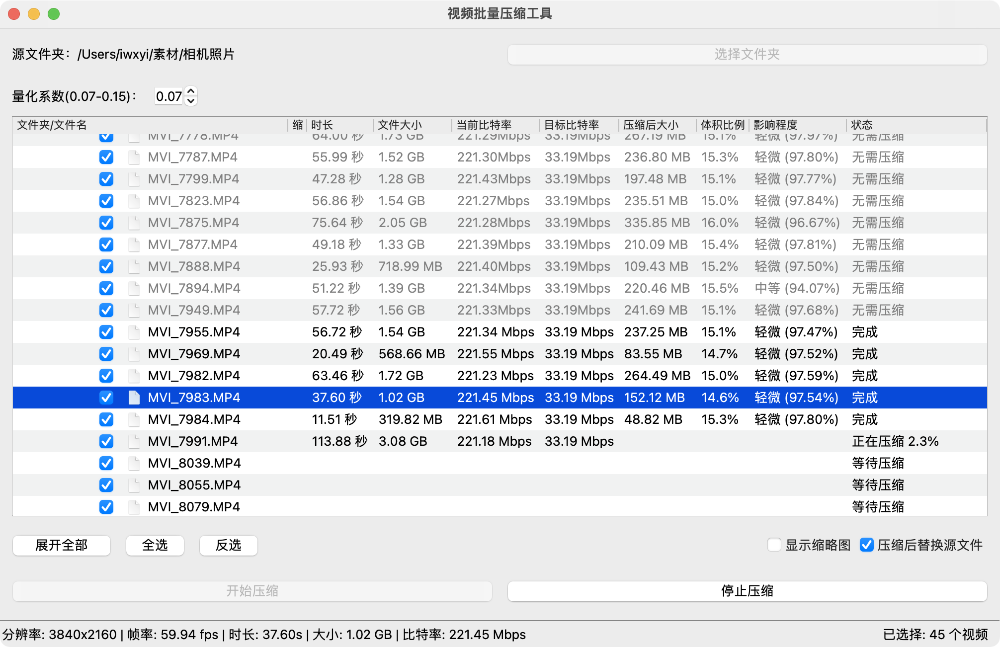

# 视频批量无损压缩工具

在几乎不影响视频质量的前提下，批量压缩视频文件，并保留原有文件的属性。

## 特点

- 几乎无损！自定义比特率的量化系数
- 文件夹多层批量多选
- 保留原有文件属性，不影响修改时间
- 全自动化处理，无需任何手动干预
- 计算压缩前后相似度（SSIM），让用户放心压缩

## 备注

- 如果不替换源文件，则压缩后的文件名会自动加上_comp后缀
- 替换源文件时会恢复文件的元数据（理论上是全部），但是实测会丢失相机镜头等信息
- 压缩时尽量暂时关闭相关的文件夹自动云同步工具，否则容易导致文件修改时间不一致

## 其他

**比特率估算公式**
比特率（Mbps）=（分辨率宽度 × 分辨率高度 × 帧率 × 量化系数）/（1024×1024）。
其中量化系数可以根据视频质量要求来选择，一般在 0.07 - 0.15 之间
